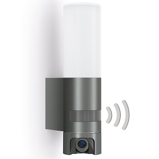

# Steinel L620 SC Camera



## Camera dismounting and hardware identification

Dismouting of Steinel Cameras is quite hard, and seems to don't be faisible without breaking a foot of the camera support. This confirm the need of developping a script to install a new firmware without need to open the camera. All connectors are stick (stick can be removed, sometime with breaking a connector...).

### Steinel L620 SC camera is based on this hardware
- SoC : Hisilicon HI3518EV300
- Device ID : 50H20L
- Sensor : SC2315E
- Wifi Card : Realtek RTL8188FU (to be confirmed)
- Light managment card : see above

### Wiring diagram of the light


### Photos

Camera Module


Reset Button card


Light Management card


## identification of console serial port and connection

The communication between the camera module and the light management extention card is done via UART port. It appear that this UART port is the console serial port.
The port is only used at u-boot level. The kernel use this serial port for light management.

UART configuration at u-boot level : speed 115200

UART configuration at kernel level : speed 9600

using a serial communication with putty, it is possible to interupt boot at u-boot level by pressing Ctrl+c.

Here is the full boot output on firmware 20220712

```
System startup

Uncompress Ok!

U-Boot 2016.11+ (Nov 23 2019 - 14:15:27 +0800)hi3518ev300

Relocation Offset is: 036ea000
Relocating to 43eea000, new gd at 43ea9ef0, sp at 43ea9ed0
SPI Nor:  eFlashType: 3.
Flash Name: XM_W25Q128FV, W25Q128JV{0xEF4018), 0x1000000.
@hifmc_spi_nor_probe(), XmSpiNor_ProtMgr_probe(): OK.
@XmSpiNor_enableQuadMode(), Disable Quad Failed, SRx: [2, 0x2].
CONFIG_CLOSE_SPI_8PIN_4IO = y.
read->iftype[0: STD, 1: DUAL, 2: DIO, 3: QUAD, 4: QIO]: 1.
lk=>6, 0x800000.
SRx val: {[1, 0x38], [1, 0x2], [1, 0x60], [0, 0x0]}, SrVal: 0x700000000600238.
MMC:   hisi-sdhci: 0 (SD)
In:    serial
Out:   serial
Err:   serial
Net:   eth0
Hit ctrl+c to stop autoboot:  0
@do_spi_flash_probe() flash->erase_size:65536
device 0 offset 0x40000, size 0x550000

SF: 5570560 bytes @ 0x40000 Read: OK
srcAddr 0x43000000, dstAddr 0x42000000
created_inode 0x43eaba40
find_squashfs_file: name bin, start_block 0, offset 2111, type 1
find_squashfs_file: name boot, start_block 0, offset 2207, type 1
read inode: name boot, sb 0, of 2207, type 1
find_squashfs_file: name uImage, start_block 0, offset 2143, type 2
read inode: name uImage, sb 0, of 2143, type 2
write_file: regular file, blocks 8
len 1954007
### FS load complete: 1954007 bytes loaded to 0x42000000
## Booting kernel from Legacy Image at 42000000 ...
   Image Name:   Linux-4.9.37
   Image Type:   ARM Linux Kernel Image (uncompressed)
   Data Size:    1953943 Bytes = 1.9 MiB
   Load Address: 40008000
   Entry Point:  40008000
   Loading Kernel Image ... OK

Starting kernel ...

Uncompressing Linux... done, booting the kernel.
```

## original firmware backup

### create a backup

Using u-boot and a sd card, it is possible to make a backup of the original firmware.

```

# select sd card dev 0
mmc dev 0

# erase sd card
mmc erase 0x10 0x8000

#  erase ram
mw.b 0x42000000 ff 0x1000000; 

# select rom device
sf probe 0; 

# copy whole rom to ram
sf read 0x42000000 0x0 0x1000000;

# write ram to sd card in block mode
mmc write 0:1 0x42000000 0x10 0x8000

```

Move SD Card on a linux machine and run (identify dev path of sd card, /dev/sdb in this case) :

```
sudo dd bs=512 skip=16 count=32768 if=/dev/sdb of=./fulldump20220712.bin
```


### restore the backup

Using u-boot (openipc or original) and a sd card in FAT32 with fulldump20220712.bin

```
mw.b 0x42000000 ff 0x1000000;
fatload mmc 0:1 0x42000000 fulldump20220712.bin
sf probe 0;
sf lock 0;
sf erase 0x0 0x1000000;
sf write 0x42000000 0x0 0x1000000;
```

## original firmware analysis

firmware analyzed : 07.12.2022

FirmwareInfo

```
PRODUCT_NAME=HI3518EV300_50H20L_16M_IPC_8188FTVHISI_PED_XMJP_NONE_NONE_SimpChn_NP_CamLight_V1.000.00.0.R
CHIP_ID=HI3518EV300
DEVICE_ID=50H20L
FLASH_SIZE=16M
PRODUCTION_TYPE=IPC
EXTENFUNC=8188FTV,HISI_PED
NATURE=XMJP
DEVICEEXT_ID=NONE
INTELLIGENT=NONE
LANGUAGES=SimpChinese
VIDEOSTANDARDS=PAL,NTSC
DEFAULT_VIDEOSTANDARD=NTSC
VSP=CamLight
NET_UPGRADE_FILE=General_CamLight_IPC_HI3518EV300_50H20L_8188FU_V4.03.R12.Nat.20221207_ALL.bin
BURN_FILE=upall_IPC_HI3518EV300_50H20L_8188FU.Nat.20221207.bin
```

### printenv from u-boot

```
hisilicon # printenv
NID=0x0001
appCloudExAbility=toaXOp2PN2M=
appSystemLanguage=English
appVideoStandard=PAL
baudrate=115200
bootargs=init=linuxrc mem=${osmem} console=ttyAMA0,115200 root=/dev/mtdblock1 rootfstype=squashfs mtdparts=hi_sfc:0x40000(boot),0x540000(romfs),0x740000(user),0x180000(web),0x80000(custom),0x140000(mtd)
bootcmd=setenv setargs setenv bootargs ${bootargs};run setargs;sf probe 0;sf read 43000000 40000 550000;squashfsload;bootm 0x42000000
bootdelay=0
bootfile="uImage"
da=mw.b 0x42000000 ff 1000000;setenv loadaddr 0x42000000;setenv bootfile u-boot.bin.img;fatload mmc 0;sf probe 0;flwrite
dc=mw.b 0x42000000 ff 1000000;setenv loadaddr 0x42000000;setenv bootfile custom-x.cramfs.img;fatload mmc 0;sf probe 0;flwrite
dd=mw.b 0x42000000 ff 1000000;setenv loadaddr 0x42000000;setenv bootfile mtd-x.jffs2.img;fatload mmc 0;sf probe 0;flwrite
de=mw.b 0x42000000 ff 1000000;setenv loadaddr 0x42000000;setenv bootfile u-boot.env.img;fatload mmc 0;sf probe 0;flwrite
dl=mw.b 0x42000000 ff 1000000;setenv loadaddr 0x42000000;setenv bootfile logo-x.cramfs.img;fatload mmc 0;sf probe 0;flwrite
dr=mw.b 0x42000000 ff 1000000;setenv loadaddr 0x42000000;setenv bootfile romfs-x.cramfs.img;fatload mmc 0;sf probe 0;flwrite
du=mw.b 0x42000000 ff 1000000;setenv loadaddr 0x42000000;setenv bootfile user-x.cramfs.img;fatload mmc 0;sf probe 0;flwrite
dw=mw.b 0x42000000 ff 1000000;setenv loadaddr 0x42000000;setenv bootfile web-x.cramfs.img;fatload mmc 0;sf probe 0;flwrite
ethact=eth0
ethaddr=00:12:31:88:dc:38
gatewayip=192.168.1.1
gpio0=0x14
gpio1=0x16
gpio2=0x17
gpio3=0x3
gpioval0=0x0
gpioval1=0x1
gpioval2=0x0
gpioval3=0x0
ipaddr=192.168.1.10
muxctl0=0x120c0010
muxctl1=0x120c0018
muxctl2=0x120c001c
muxctl3=0x100c000c
muxval0=0x1e02
muxval1=0x1d02
muxval2=0x1502
muxval3=0x1000
netmask=255.255.0.0
osmem=43M
serverip=192.168.1.107
stderr=serial
stdin=serial
stdout=serial
tk=setenv loadaddr 0x42000000;setenv bootfile uImage;fatload mmc 0;setenv setargs setenv bootargs ${bootargs};run setargs;bootm 0x42000000
ua=mw.b 0x42000000 ff 1000000;setenv loadaddr 0x42000000;setenv bootfile upall_verify.img;fatload mmc 0;sf probe 0;flwrite
up=mw.b 0x42000000 ff 1000000;setenv loadaddr 0x42000000;setenv bootfile update.img;fatload mmc 0;sf probe 0;flwrite
ver=U-Boot 2016.11 (Oct 29 2018 - 16:06:3
verify=n

Environment size: 2390/65532 bytes
```
### extracting firmware

extracting firmware using binwalk (could be needed to install additionnal extracting tools. Check binwalk output)

```
binwalk -e fulldump20220712.bin
```

Work in progress

## light management extension card analysis

- Light managment card :
  - 2 PIR Sensors
  - 1 Light Sensor
  - 1 Led
  - Based on microchip GX20-2120 (SSOP-20 format) ref U2

pinout of the U2 microchip :


the communication bettween the light managment card and the camera proc is serial using console serial port.
Communication is only managed from camera to light management card. Light management card don't send any data to the module.

All configuration done from the Steinel App send a 16 bytes data format to the light management module.

```
Light mode : ON     : 42 4D 64 55 00 xx xx xx 00 00 00 00 00 00 00 00
Light mode : DETECT : 42 4D 62 55 00 xx xx xx 00 00 00 00 00 00 00 00
Light mode : CONFIG : 42 4D 65 55 00 xx xx xx 00 00 00 00 00 00 00 00

Alarm mode : ON/TON : 42 41 62 55 00 xx xx xx 00 00 00 00 00 00 00 00
Alarm mode : OFF    : 42 41 7A 55 00 xx xx xx 00 00 00 00 00 00 00 00

Resume/quit:        : 42 46 62 55 00 49 6E 63 00 00 00 00 00 00 00 00

Dist detec :     0% : 42 44 61 55 00 72 67 65 00 00 00 00 00 00 00 00  
                          62-78
Dist detec :   100% : 42 44 79 55 00 72 67 65 00 00 00 00 00 00 00 00

Sensor     : moon   : 42 58 61 55 00 72 67 65 00 00 00 00 00 00 00 00
                          62-76
Sensor     : sun    : 42 58 77 55 00 72 67 65 00 00 00 00 00 00 00 00

Niveau     :    30% : 42 48 68 55 00 72 67 65 00 00 00 00 00 00 00 00
                          69-79
Niveau     :   100% : 42 48 7A 55 00 72 67 65 00 00 00 00 00 00 00 00
                        
Temporisa  :   1min : 42 54 62 55 00 72 67 65 00 00 00 00 00 00 00 00
Temporisa  :   3min : 42 54 64 55 00 72 67 65 00 00 00 00 00 00 00 00                         
Temporisa  :  10min : 42 54 6B 55 00 72 67 65 00 00 00 00 00 00 00 00                         
Temporisa  :  15min : 42 54 70 55 00 72 67 65 00 00 00 00 00 00 00 00 

Basic Light: ON/OFF : 42 4C 61 55 00 72 67 65 00 00 00 00 00 00 00 00
                       
Basic Light: disable: 42 4C 61 55 00 72 67 65 00 00 00 00 00 00 00 00
                          62-6B
Basic Light:    40% : 42 4C 6C 55 00 72 67 65 00 00 00 00 00 00 00 00 

Tps lum con: Allnigh: 42 53 61 55 00 72 67 65 00 00 00 00 00 00 00 00  
Tps lum con:     2h : 42 53 66 55 00 72 67 65 00 00 00 00 00 00 00 00                         
Tps lum con:     4h : 42 53 6B 55 00 72 67 65 00 00 00 00 00 00 00 00                         
Tps lum con:     6h : 42 53 70 55 00 72 67 65 00 00 00 00 00 00 00 00                         
Tps lum con:    10h : 42 53 7A 55 00 72 67 65 00 00 00 00 00 00 00 00  
```

## OpenIPC installation using console

Insert a SD Card in FAT32 format with the following bin file :
- u-boot : u-boot-hi3518ev300-universal.bin
- rootfs : rootfs.squashfs.hi3518ev300 (utltimate version)
- uImage : uImage.hi3518ev300

### updating u-boot

Insert SD card, and press Ctrl+c to enter original u-boot

```
# clear ram
mw.b 0x42000000 ff 0x50000

# read sd card to ram
fatload mmc 0:1 0x42000000 u-boot-hi3518ev300-universal.bin

# select rom
sf probe 0;

# unlock rom
sf lock 0;

# erase rom
sf erase 0x0 0x50000;

# write ram to rom
sf write 0x42000000 0x0 0x50000;

# restart
reset
```

### updating kernel

Prepare rom

```
run setnor16m
```

Install uImage

```
# clear ram
mw.b 0x42000000 ff 0x1000000;

# read sd card to ram
fatload mmc 0:1 0x42000000 uimage.hi3518ev300;

# select rom
sf probe 0; 

# erase rom
sf erase 0x50000 0x300000;

# write ram to rom
sf write 0x42000000 0x50000 0x300000;
```

Install rootfs

```
# clear ram
mw.b 0x42000000 ff 0x1000000;

# read sd card to ram
fatload mmc 0:1 0x42000000 rootfs.squashfs.hi3518ev300;

# select rom
sf probe 0; 

# erase rom
sf erase 0x350000 0xa00000;

# write ram to rom
sf write 0x42000000 0x350000 0xa00000;
```

## Wi-Fi card activation

RTL8188FU Wifi card is nativelly managed by OpenIPC but need to be activated. Edit the file /etc/network/interfaces with vi

```
vi /etc/network/interfaces
```

replace wlan0 section with the following

```
auto wlan0
iface wlan0 inet dhcp
    pre-up modprobe rtl8188fu
    pre-up wpa_passphrase "SSID" "password" >/tmp/wpa_supplicant.conf
    pre-up sed -i '2i \\tscan_ssid=1' /tmp/wpa_supplicant.conf
    pre-up sleep 3
    pre-up wpa_supplicant -B -D nl80211 -i wlan0 -c/tmp/wpa_supplicant.conf
    post-down killall -q wpa_supplicant
```

## sensor activation

Sensor is automatically detected by OpenIPC and the following environment variable is added to u-boot

```
sensor=sc2315e
```

## module development for light extension card
Work in progress

## module integration in OpenIPC
Work in progress

## script development to automate firmware installation using SD card
